# Proyecto SQL: Análisis de Datos de Ventas y Desempeño Comercial

## Resumen 

Actualmente, la empresa **SuperStore** no cuenta con un análisis estructurado que permita identificar patrones de ventas, productos más rentables y tiempos de envío. Por ello, mi objetivo es analizar los datos de ventas utilizando **SQL** en **SQL Server Management Studio**, con la finalidad de obtener una visión clara del rendimiento comercial, el comportamiento de los clientes y la rentabilidad de los productos.


## Estructura del Proyecto

- [Sobre los Datos](#sobre-los-datos)
- [Tareas](#tareas)
- [Limpieza de Datos](#limpieza-de-datos)
- [Análisis Exploratorio de Datos e Insights](#análisis-exploratorio-de-datos-e-insights)


## Sobre los Datos

Los datos originales, junto con una explicación de cada columna, se pueden encontrar [aquí](https://www.kaggle.com/datasets/thuandao/superstore-sales-analytics).

El conjunto de datos incluye una tabla que capturan el registro de ventas, pedidos, clientes, productos, enviós distribuidos en más de 25,000 registros y 21 columnas.

Para realizar 


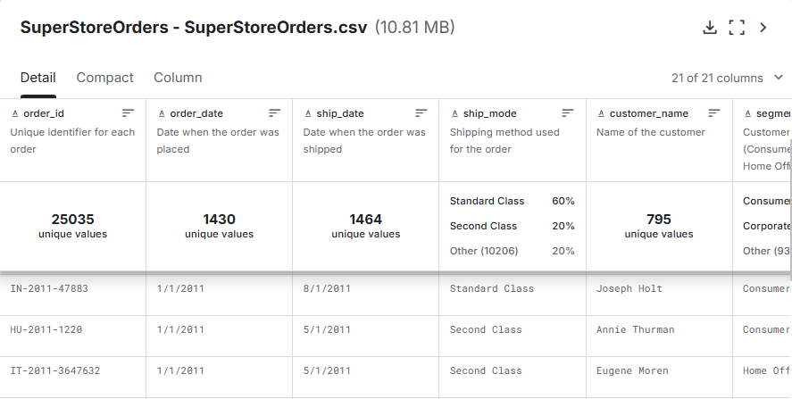


## Tareas (Task)


En este análisis, ayudo a responder las siguientes preguntas de negocio sobre ventas, clientes, productos y logística:

1. **Distribución de ventas por subcategoría:** ¿Cómo se distribuyen las ventas de la subcategoría y año en términos porcentuales?

2. **Contribución por prioridad de pedido:** ¿Qué porcentaje de ingresos aporta cada nivel de prioridad de pedido?

3. **Clientes más activos:** ¿Qué clientes compran la mayor cantidad de productos?

4. **Preferencias de envío:** ¿Qué tipos de envío fueron más utilizados y cuántos pedidos se realizaron por cada uno?


5. **Productos más rentables** ¿Cuáles son los productos que generan mayor ganancia por año?

6. **Tiempo de envío y rentabilidad:**¿Qué productos tienen un tiempo de almacenamiento superior al promedio y cómo se relaciona esto con su rentabilidad?

7. **Clientes rentabilidad:** ¿Qué segmentos de clientes generan mayor rentabilidad y cómo ha evolucionado en el tiempo?

8. **Eficiencia logística:**¿Qué pedidos presentan altos costos de envío pero baja rentabilidad?


9. **Volumen de ventas:**¿Cuáles son los productos más vendidos dentro de cada categoría según la cantidad total?

10. **Costos de envío por categoría:**¿Qué categorías presentan pedidos con costos de envío superiores al promedio general?


## Limpieza de Datos

Antes de realizar el análisis, es fundamental asegurar que los datos estén limpios y listos.

#### Valores Nulos o Faltantes

Primero, verifiqué la existencia de valores faltantes en el campo clave: `order_id`. No se encontraron valores nulos.

```sql
-- Verificar valores faltantes en la tabla SuperStoree --

SELECT COUNT(*) 
FROM SuperStore
WHERE order_id IS NULL;

-- Verificar valores duplicados en la tabla SuperStore --

SELECT order_id,COUNT(*) 
FROM SuperStore
GROUP BY order_id 
HAVING COUNT(*)>1
```

Como la base de datos original se encuentra en una sola tabla, se procedió a dividirla en 4 tablas mediante el uso de SELECT INTO, con el objetivo de estructurar mejor la información y facilitar el análisis mediante relaciones. Esta separación permite trabajar de forma más organizada y realizar cruces de datos utilizando JOIN.

```sql
SELECT DISTINCT 
    customer_name,
    segment,
    state,
    country,
    market,
    region
INTO customers
FROM basetotal;

SELECT DISTINCT 
    product_id,
    product_name,
    category,
    sub_category
INTO products
FROM basetotal;


SELECT DISTINCT 
    order_id,
    order_date,
    ship_date,
    ship_mode,
    customer_name,
    order_priority,
    year
INTO orders
FROM basetotal;


SELECT 
    order_id,
    product_id,
    sales,
    quantity,
    discount,
    profit,
    shipping_cost
INTO order_details
FROM basetotal;

```


## Análisis Exploratorio de Datos (EDA) e Insights

### Pregunta #1: ¿Cómo se distribuyen las ventas de la subcategoría y año en términos porcentuales?

Calculé el total de ventas por año y subcategoría utilizando SUM(sales) y luego obtuve el porcentaje que representa cada año dentro de su subcategoría usando SUM() OVER (PARTITION BY sub_category). Esto me permite ver qué proporción de las ventas corresponde a cada subcategoría en cada año.


```sql

with analisis_subcategoria as(
select
      year,
      category,
      sub_category,
      SUM(sales) as'suma_total',
	  concat(format(sum(sales) *100.0/sum(sum(sales)) over ( partition by sub_category),'N2'),'%') as '%ventas'
from basetotal
group by year,category,sub_category
)
select * from analisis_subcategoria

order by sub_CATEGORY,year desc;

```
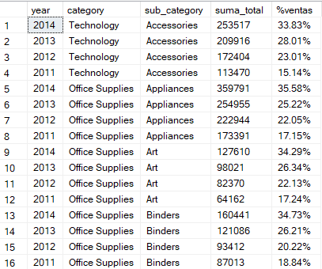

_Distribución porcentual de ventas_

El análisis muestra que la participación de ventas varía entre subcategorías y años, evidenciando que algunas subcategorías concentran una mayor proporción de ingresos dentro del total.

La empresa podria aplicar diferentes estrategias comerciales en las subcategorías con mayor participación de ventas, ya que representan el mayor aporte al ingreso


### Pregunta #2: ¿Qué porcentaje de ingresos aporta cada nivel de prioridad de pedido?

Se agruparon primero los datos por nivel de prioridad de pedido utilizando GROUP BY order_priority y se obtuvo el total de ingresos mediante la función SUM(sales). Para determinar la participación de cada nivel respecto al total general, se aplicó una función de ventana SUM(SUM(sales)) OVER (), la cual permite obtener el total global de ingresos.


```sql

with ingresos_categoria as(
select 
        order_priority,
        sum(sales) 'Ingreso Totales', 
        concat(format(sum(sales) *100.0/SUM(sum(sales))over (),'N2'),'%') as 'Porcemtaje'
from basetotal
group by order_priority
)
select 
      * from ingresos_categoria
order by [Ingreso Totales] desc;

```

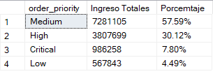

_Ingreso_Prioridad_

Los resultados nos indican que los ingresos mas fuertes para la empresa son por prioridad **Medium**, que representa mas del 50% del total, se sugiere analizar los niveles de prioridad con menor contribución para identificar posibles mejoras en su gestión, tiempos de atención o estrategia de uso.


### Pregunta #3: ¿Qué clientes compran la mayor cantidad de productos?

Se identificaron los clientes que compran la mayor cantidad de productos utilizando SUM(quantity) para obtener el total de unidades adquiridas por cada cliente. Luego, se agruparon los datos por customer_name mediante GROUP BY y se ordenaron de forma descendente para visualizar a los clientes con mayor volumen de compras..

```sql

with mejores_vendedores as (
select TOP 10
      sum(quantity) as 'Productos_vendidos',
      customer_name from basetotal
where quantity > 0
group by customer_name
order by sum(quantity) desc
)

select * from mejores_vendedores;

```

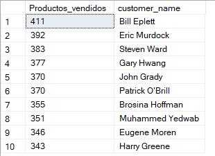

_Clientes_Top_

El análisis permite identificar a los clientes con mayor volumen de compras, evidenciando que un grupo reducido concentra una gran cantidad de productos adquiridos, lo que los convierte en clientes clave para el negocio en términos de volumen de ventas.


### Pregunta #4: ¿Qué tipos de envío fueron más utilizados y cuántos pedidos se realizaron por cada uno?

Se utilizó la función COUNT(order_id) para contabilizar la cantidad de pedidos por cada tipo de envío (ship_mode). Los datos se agruparon por año y tipo de envío mediante GROUP BY, lo que permitió analizar la distribución de los pedidos a lo largo del tiempo.

```sql

with tipo_clase_viaje as(
select 
      year,
	  ship_mode,
	  count(order_id) as 'cantidad_pedidos' 
from basetotal
group by year,ship_mode
)

select *
from tipo_clase_viaje

order by cantidad_pedidos desc,year ;

```

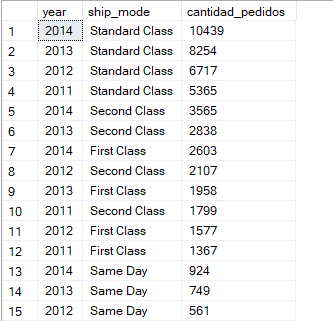

_Distribución por pedidos_

Algunos tipos de envío concentran la mayor cantidad de pedidos, lo que indica su preferencia por parte de los clientes; por ello, se recomienda optimizar estos métodos para mejorar la eficiencia operativa


### Pregunta #5: ¿Cuáles son los productos que generan mayor ganancia por año?

Primero se utilizo la función SUM(profit) para calcular la ganancia total generada por cada producto. Los datos se agruparon por year y product_name mediante GROUP BY, lo que permitió identificar los productos con mayores beneficios dentro de cada año.


```sql

with top_ganancia_producto as (
select top 10
year,product_name,format(sum(profit),'N2') as 'total_ganancia'
from basetotal
group by year,product_name
order by sum(profit) desc
)
select * from top_ganancia_producto

```

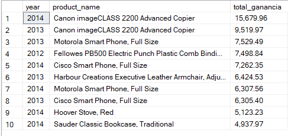

_Producto_ganancia_

Se identificó que el producto Canon imageCLASS 2200 Advanced Copier ha sido uno de los más rentables, destacando por generar la mayor ganancia en dos años consecutivos, se recomienda asegurar su disponibilidad y considerar estrategias comerciales para potenciar aún más sus ventas, dado su impacto positivo en las ganancias.


### Pregunta #6: ¿Qué productos tienen un tiempo de almacenamiento superior al promedio y cómo se relaciona esto con su rentabilidad?

Para esta pregunta, se utilizo la función AVG([Dias de almacén]) para calcular el tiempo promedio de almacenamiento por producto y AVG(profit) para obtener su rentabilidad promedio. Los datos se agruparon por product_name mediante GROUP BY

```sql

WITH ganancias_promedio_producto AS (
    SELECT 
        product_name,
        AVG([Dias de almacén]) AS Dias_almacen,
        AVG(profit) AS promedio_ganancias
    FROM basetotal
    GROUP BY product_name
    HAVING AVG([Dias de almacén]) > (
        SELECT AVG([Dias de almacén]) FROM basetotal
    )
)
SELECT *
FROM ganancias_promedio_producto
ORDER BY promedio_ganancias desc;

```

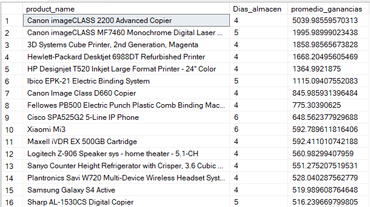


Un mayor tiempo de almacenamiento indica que algunos productos tardan más en ser procesados o enviados; sin embargo, esto no siempre se traduce en mayor rentabilidad


### Pregunta #7: ¿Qué segmentos de clientes generan mayor rentabilidad y cómo ha evolucionado en el tiempo?

Para esta pregunta, utilicé la función SUM(profit) para calcular la ganancia total generada por cada segmento de cliente. Los datos se agruparon por year y segment mediante GROUP BY, lo que permitió analizar la evolución de la rentabilidad a lo largo del tiempo.

```sql

WITH rentabilidad_segmento AS (
    SELECT 
        year,
        segment,
        SUM(profit) AS total_ganancia
    FROM basetotal
    GROUP BY year, segment
)
SELECT *
FROM rentabilidad_segmento
ORDER BY year, total_ganancia DESC;

```

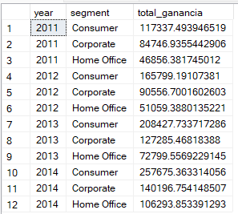


Se recomienda enfocar estrategias comerciales y de fidelización en los segmentos más rentables para maximizar los ingresos.


### Pregunta #8: ¿Qué pedidos presentan altos costos de envío pero baja rentabilidad?


Para esta pregunta, utilicé una comparación entre shipping_cost y profit, con el objetivo de identificar pedidos donde el costo logístico es alto pero la ganancia es baja o incluso negativa.

```sql

SELECT 
    order_id,
    product_name,
    shipping_cost,
    profit
FROM basetotal
WHERE shipping_cost > (
    SELECT AVG(shipping_cost) FROM basetotal
)
AND profit < (
    SELECT AVG(profit) FROM basetotal
)
ORDER BY shipping_cost DESC;

```

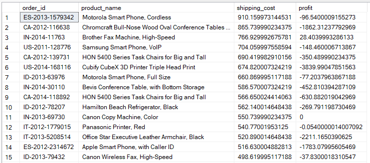

Se recomienda revisar la estrategia logística y los costos de envío en estos casos, ya que podrían estar reduciendo las ganancias del negocio.


### Pregunta #9: ¿Cuáles son los productos más vendidos dentro de cada categoría según la cantidad total?

Utilicé la función SUM(quantity) para calcular la cantidad total vendida por producto. Luego, apliqué la función de ventana ROW_NUMBER() particionando por category

```sql
WITH ranking_productos AS (
    SELECT 
        category,
        product_name,
        SUM(quantity) AS total_vendido,
        ROW_NUMBER() OVER (PARTITION BY category ORDER BY SUM(quantity) DESC) AS ranking
    FROM basetotal
    GROUP BY category, product_name
)
SELECT *
FROM ranking_productos
WHERE ranking = 1;

```

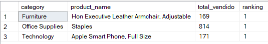

### Pregunta #10:¿Qué categorías presentan pedidos con costos de envío superiores al promedio general?

Se resolvió esta pregunta fácilmente utilizando la función AVG(shipping_cost) mediante una subconsulta, lo que permitió obtener el costo de envío promedio general. Luego, se aplicó un INNER JOIN entre las tablas order_details y products usando product_id

```sql

SELECT 
    p.category,
    AVG(od.shipping_cost) AS promedio_costo_envio
FROM order_details od
INNER JOIN products p 
    ON od.product_id = p.product_id
GROUP BY p.category
HAVING AVG(od.shipping_cost) > (
    SELECT AVG(shipping_cost)
    FROM order_details
);

```

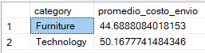

Se identificaron categorías cuyos costos de envío están por encima del promedio, se recomienda evaluar los costos de envío en estas categorías y buscar optimizaciones logística
